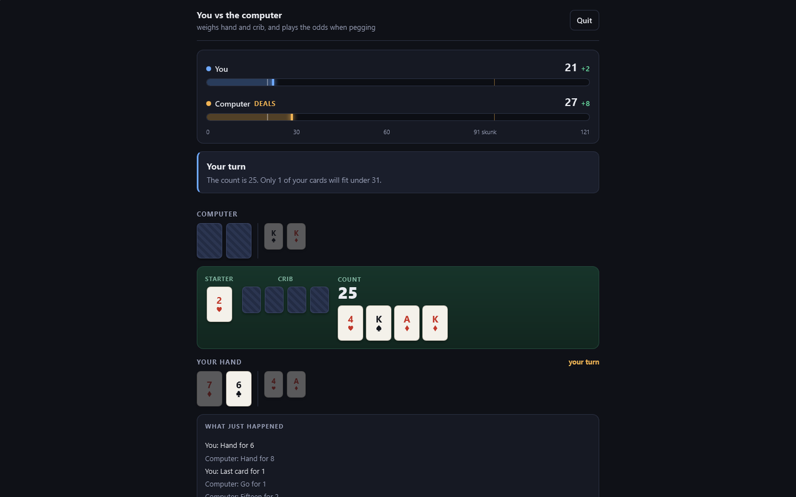
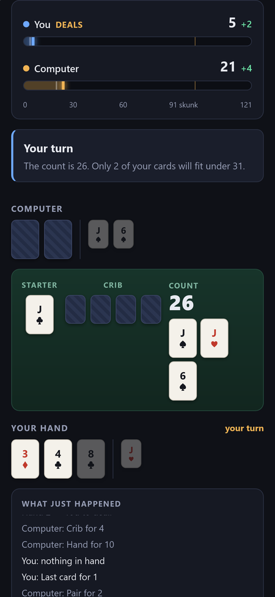
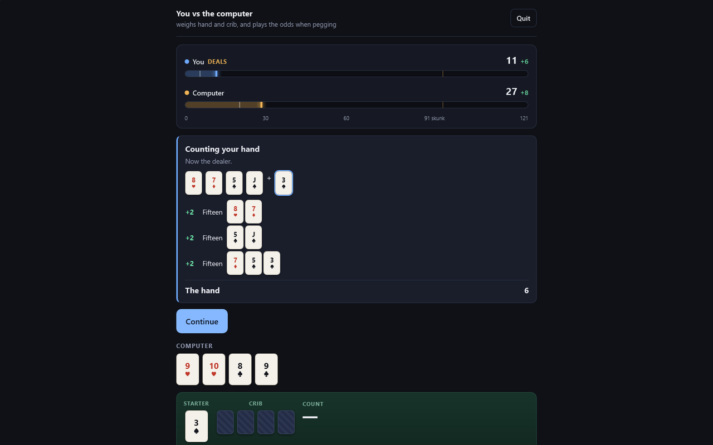
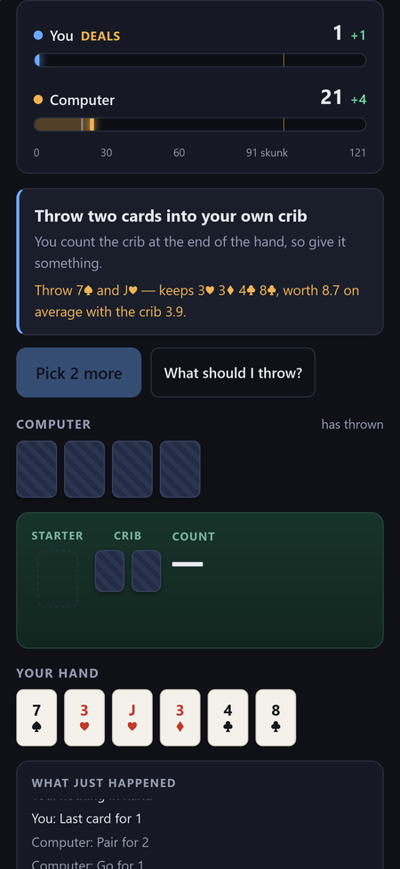

# Cribbage

Two-player cribbage to 121 against a computer opponent that actually plays well: it searches every discard, weighs the crib, and thinks about what you might peg back.

**[▶ Open the live app](https://timothyhadfield.github.io/cribbage/)** · works on phone and laptop

<p align="center">
  
  &nbsp;
  
</p>

## Features
- **A strong computer opponent** with three levels (Easy, Medium, Hard). In testing, Hard beats Easy about 78% of the time.
- **"What should I throw?"**: asks the same engine for the best discard and explains it (what you keep, and what the hand and crib are worth on average).
- **The full game**: deal, crib, cut, pegging with gos and 31s, then the show in the right order, stopping the moment someone reaches 121.
- **Every count explained**: each hand and crib is broken down line by line (fifteens, pairs, runs, flushes, nobs).
- **Score bars to 121** with the skunk line marked, plus a running log of every point scored.
- **Built-in rules guide** on the menu for anyone learning the game.
- **Online play (not switched on yet)**: matchmaking and private room codes are written and waiting on a Firebase project; see "Online play" below.

<p align="center">
  
  &nbsp;
  
</p>

## Built with
Plain HTML, CSS and JavaScript with no build step, hosted on GitHub Pages; the rules engine and AI are tested with plain Node scripts. Online play is written for Firebase (free plan).

## For developers

## How it fits together

The important idea is that **one pure engine runs behind two transports**.
`js/engine.js` is the rules — it never touches the DOM, the network, a timer,
or `Math.random` except through an injected `rng`. Everything else plugs into
it:

```
                 ┌── local.js  → ai.js         playing the computer:
                 │                             the engine runs in your tab
engine.js ───────┤
  (pure rules)   └── online.js → Firestore     playing a person: the engine
                                   ▲           runs in the HOST's tab
                                   │
                            app.js / ui.js     identical for both
```

Both transports publish the same `game:state` event and accept the same
`submit(action)` call, so `js/app.js` renders an online game and a solo game
with exactly the same code and has no idea which it is driving.

| File | What it is |
|---|---|
| `js/score.js` | Scoring. Fifteens, pairs, runs, flushes, nobs, pegging. Pure, and Node-requireable. |
| `js/engine.js` | The game state machine: deal → discard → cut → play → show → 121. |
| `js/ai.js` | The computer opponent. Exact discard search, one-ply pegging risk model. |
| `js/crib-ev.js` | **Generated.** Expected crib value for all 169 possible throws. |
| `js/local.js` | Transport: vs the computer. |
| `js/online.js` | Transport: vs a person, over Firestore. |
| `js/ui.js` / `js/app.js` | Rendering, and turning clicks into actions. |
| `firestore.rules` | The entire security boundary — there is no server. |
| `tools/build-crib-ev.js` | Regenerates the crib table. Only needed if the model changes. |

## Running it

It is static. Open `index.html`, or serve the folder:

```bash
python -m http.server 8777
```

## Tests

```bash
node test/score.test.js     # scoring: the 29 hand, runs, the crib flush rule
node test/engine.test.js    # pegging edge cases, go/last-card, stopping at 121
node test/ai.test.js        # the AI, plus a 900-game tournament between levels
```

No framework — they are plain Node scripts that print what they checked and
exit non-zero on failure. The engine test plays 300 complete games with random
legal moves to prove the pegging phase can't deadlock; the AI test plays 900
more to prove the difficulty levels are actually different (hard beats easy
about 78% of the time, and medium about 56%).

The security rules have their own suite, which needs the Firestore emulator:

```bash
cd test && npm install && npm test
```

> **Known problem:** the emulator currently refuses to start on this machine —
> it exits immediately, silently, with code `-1`, both here and in the sibling
> Secret Hitler project. This looks like the long-standing incompatibility
> between the bundled emulator jar and **Java 21**; the usual fix is a JDK 17
> `JAVA_HOME`, or `firebase setup:emulators:firestore` to pull a newer jar.
> `test/rules.test.js` is written and complete but has **not been executed**.

## The computer opponent

Two decisions, handled quite differently.

**The discard** is searched exactly. For each of the 15 ways to break up six
cards it evaluates the kept hand against every one of the 46 starters that
could still be cut, then adds what the throw is worth in the crib — *plus* when
the crib is yours, *minus* when it isn't. That second term is why the same six
cards produce opposite decisions depending on who deals: holding 5-5-6-7-8-9,
it throws itself the two fives as dealer, and throws 8-9 as non-dealer.

The crib figure comes from `js/crib-ev.js`, sampled once by
`tools/build-crib-ev.js` (30,000 deals per entry) rather than computed live,
because doing it honestly at decision time is ~700,000 hand evaluations and a
visible freeze. The numbers line up with published cribbage tables — 5-5 is the
best throw at 8.83, K-10 the worst at 3.16.

**The pegging** is a one-ply risk model: for each legal card, what it scores
now, minus the average of what every card the opponent could still be holding
would score in reply. Nobody wrote down "don't lead a five" — it falls out of
sixteen ten-cards answering it for two.

Difficulty is how much of that the opponent uses, not a handicap:

| | discard | pegging |
|---|---|---|
| **Easy** | judges the kept hand as it stands, ignores the starter and the crib, and wavers | takes what's in front of it |
| **Medium** | exact hand search, crib ignored | avoids the obvious traps |
| **Hard** | hand and crib | full risk model, plays for the win when it's in reach |

## Online play

Matchmaking, room codes, and live play with no server at all.

**Finding a stranger.** You put yourself in a public queue and look for someone
else in it. The race — two people searching at the same instant, each finding
the other, each starting a game — is settled by a Firestore transaction that
claims the other player's queue entry *and your own* atomically. Whoever
commits first becomes the host; the loser's retry finds both entries taken and
simply waits to be collected.

**Playing a friend.** The same flow with the search removed: a six-character
room code (from an alphabet with no `O`/`0` or `I`/`1`, because these get read
aloud) stands in for the queue entry.

**During the game** the host's browser is the referee. It runs the engine,
writes the public state to the match document, writes each player's cards to a
document only that player can read, and drains a queue of submitted moves.
Illegal moves are dropped rather than applied. If the host reloads, the full
state is in `matches/{id}/host/state` and the game resumes.

### The limitation, stated plainly

**A determined host can see your cards.** Somebody's browser has to hold the
deck, and on Firebase's free plan there is no server to be that somebody —
Cloud Functions need the paid plan, and this project does not use them. The
security rules make sure nothing is ever *served* to the wrong player, and
`test/rules.test.js` exists to keep them honest, but the host's own tab
necessarily holds the whole deal and devtools will show it.

For playing friends this is fine. It is also why `engine.js` is a pure module
with no dependencies: an authoritative referee can be dropped in later without
rewriting the game.

### Setting up online play

Until `js/firebase-config.js` has real values, `Online.ready` is false, the
menu says so, and everything else still works. To turn it on:

1. Create a Firebase project on the **Spark (free) plan**.
   **If any screen asks for billing or to upgrade to Blaze, stop — nothing here
   needs it.**
2. **Firestore Database → Create database.** The location is permanent; `nam5`
   matches the sibling projects.
3. **Authentication → Sign-in method → enable Anonymous.** (Google too, if you
   want the optional account-linking later.)
4. **Authentication → Settings → Authorized domains** → add
   `timothyhadfield.github.io`.
5. Paste the config in:
   ```bash
   firebase apps:sdkconfig WEB --project <your-project-id>
   ```
   into `js/firebase-config.js`, replacing `const FIREBASE_CONFIG = null;`.
6. Deploy the rules — **this is the security boundary, the app is not**:
   ```bash
   firebase deploy --only firestore:rules --project <your-project-id>
   ```

No indexes are needed. The queue is read with a single `orderBy` and filtered
client-side precisely so that no composite index has to be created.

### What it costs

Spark gives 50,000 document reads and 20,000 writes a day. A complete game is
roughly 200 writes and 400 reads across both players, so the free tier covers
something like fifty games a day without noticing.

## Rules the implementation is careful about

The ones that are usually got wrong:

- **The crib's flush is stricter.** Four matching cards in your hand score 4;
  four matching cards in the crib score nothing. Only five count there.
- **Runs multiply.** A double run is 8, a double-double 16, a triple run 15 —
  scored as `length × the number of ways to make it`, not as named cases.
- **The game stops at exactly 121.** The non-dealer counts first, so they can
  go out before the dealer counts at all — hand *or* crib. Points past 121 are
  discarded rather than recorded.
- **31 pays two, and no go point on top of it.**
- **Runs while pegging ignore order.** 5-3-4 is a run of three.
